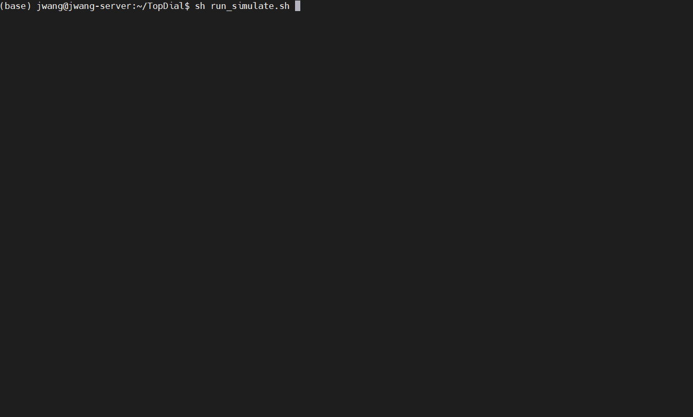

# TopDial
Target-oriented Proactive Dialogue Systems with Personalization: Problem Formulation and Dataset Curation


### Step 1: Preprocessing the seed dataset
```python
python data_preprocess.py --seed_dataset_dir ${seed_dataset_dir} ----cache_dir ${cache_dir}
```

### Step 2: Dataset curation
```python
# set your OpenAI API key
export OPENAI_API_KEY=""

python -u dialog_simulation.py --cached_seed_path ${cached_seed_path} \
    --output_dir ${output_dir} \
    --max_interaction_step ${max_interaction_step}
```

The running will be like:
<p align="center"></p>
