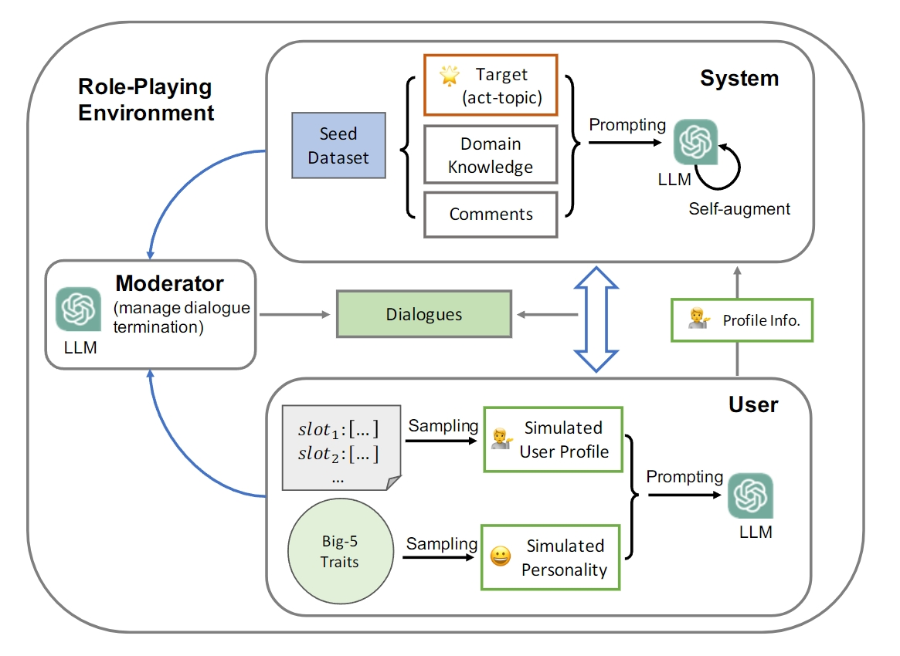

# TopDial
This repository contains code and data for the paper [Target-oriented Proactive Dialogue Systems with Personalization: Problem Formulation and Dataset Curation]() (to be updated) accepted by EMNLP 2023.

## Overview

<p align="center"></p>
Target-oriented dialogue systems, designed to proactively steer conversations toward predefined targets or accomplish specific system-side goals, are an exciting area in conversational AI. In this work, by formulating a <dialogue act, topic> pair as the conversation target, we explore a novel problem of personalized target-oriented dialogue by considering personalization during the target accomplishment process. However, there remains an emergent need for high-quality datasets, and building one from scratch requires tremendous human effort. To address this, we propose an automatic dataset curation framework using a role-playing approach. Based on this framework, we construct a large-scale personalized target-oriented dialogue dataset, **TopDial**, which comprises about 18K multi-turn dialogues.


## Dataset
We upload the curated **TopDial** dataset to the OneDrive cloud. Please download it from this OneDrive [link](https://connectpolyu-my.sharepoint.com/:u:/g/personal/21037774r_connect_polyu_hk/ETGnhjxr-UNLqYk2dEy9O2MBCcWSsiyedyHH8iKBFECuvg?e=JvDjnk).


## Dataset Curation


### Requirements
We use [Neo4j](https://neo4j.com/) as the graph database tool to process domain knowledge graph in the seed dataset. Please install it by following the [official guide](https://neo4j.com/docs/operations-manual/current/installation/). The required Python packages are listed in `requirements.txt`. Please install them by running:
```bash
pip install -r requirements.txt
```

### Seed Dataset
We use the [re-purposed version](https://github.com/iwangjian/Color4Dial) of the DuRecDial 2.0 dataset as the seed dataset. For convenience of preprocessing, please download it from this OneDrive [link](https://connectpolyu-my.sharepoint.com/:u:/g/personal/21037774r_connect_polyu_hk/EfbBtbnDmfxMmSfkvVDQ810B_59L7UmdBeo-CMwuq89X6w?e=M8yocS).


### Step 1: Preprocessing the seed dataset
```python
python data_preprocess.py --seed_dataset_dir ${seed_dataset_dir} --cache_dir ${cache_dir}
```
Running this script will generate the following files in the specified cache dir:
`cache_dialogue_{train|dev|test_seen|test_unseen}.jsonl`


### Step 2: Dataset curation
```python
# set your OpenAI API key
export OPENAI_API_KEY=""

python -u dialog_simulation.py --cached_seed_path ${cached_seed_path} \
    --output_dir ${output_dir} \
    --max_interaction_step ${max_interaction_step}
```
Running the above script will be like:
<p align="center"></p>

If you hope NOT to show the instructions and the synthesized conversations in the console, please set `--show_description` and `--show_message` to `false`.


## Acknowledgement
Our code is partially based on the implementation of [ChatArena](https://github.com/Farama-Foundation/chatarena). We thank the authors for their excellent work.


## Citation
If you use our data or code in your work, please kindly cite our work as:
```bibtex
@inproceedings{wang-etal-2023-target,
    title = "Target-oriented Proactive Dialogue Systems with Personalization: Problem Formulation and Dataset Curation",
    author = "Wang, Jian  and
      Cheng, Yi  and
      Lin, Dongding  and
      Leong, Chak Tou and
      Li, Wenjie",
    booktitle = "Proceedings of the 2023 Conference on Empirical Methods in Natural Language Processing (EMNLP)",
    month = dec,
    year = "2023",
    address = "Singapore",
    publisher = "Association for Computational Linguistics",
}
```
